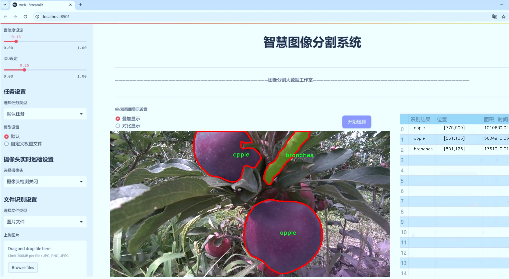
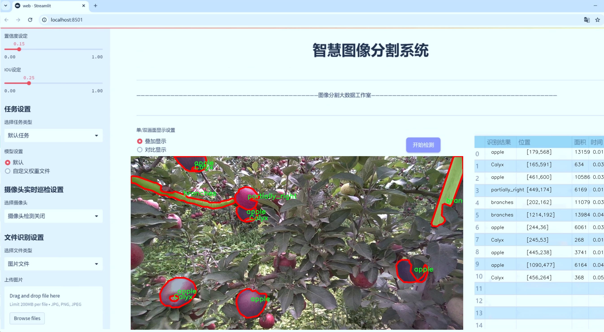
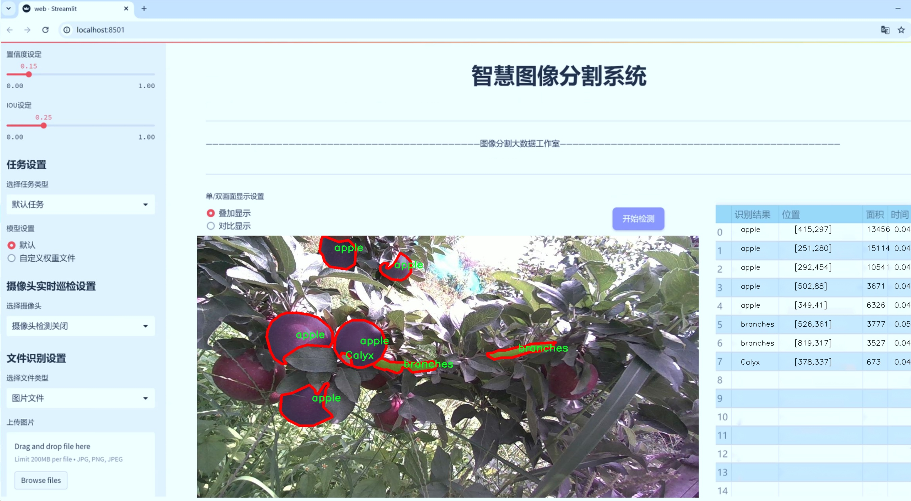
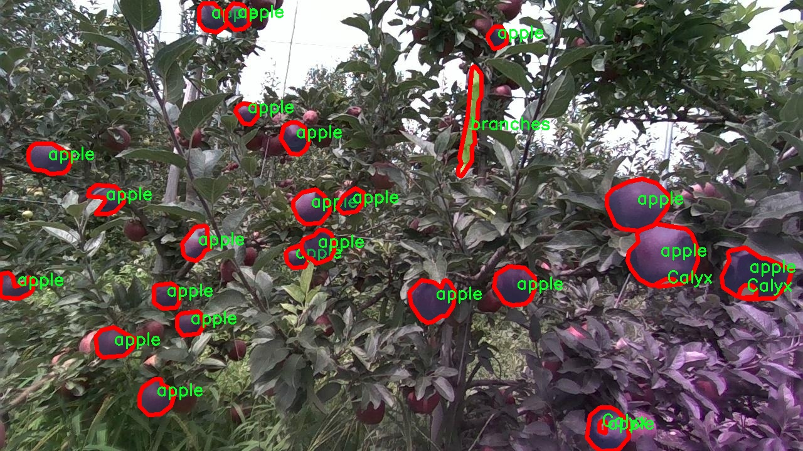
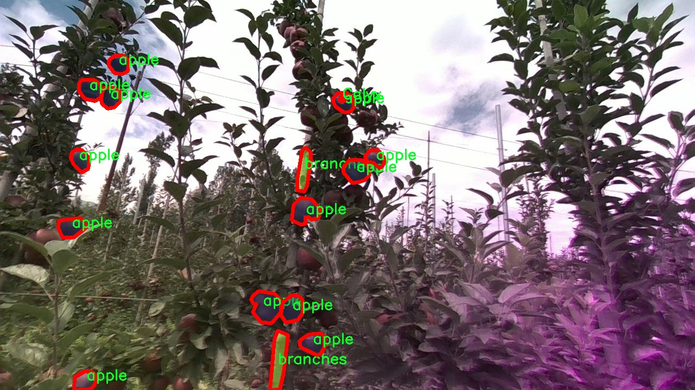
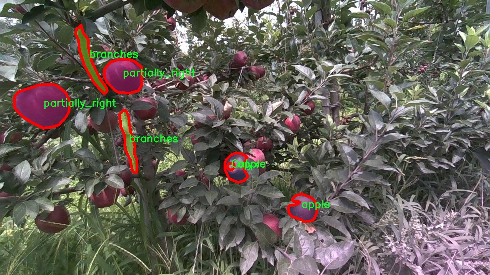
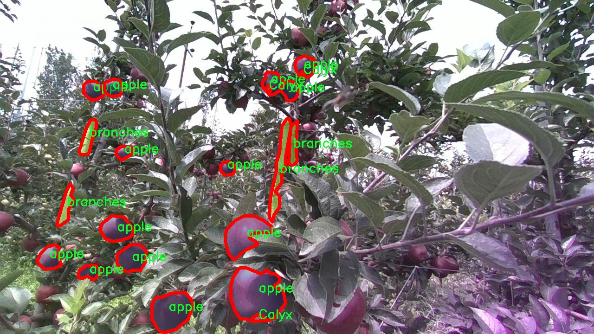
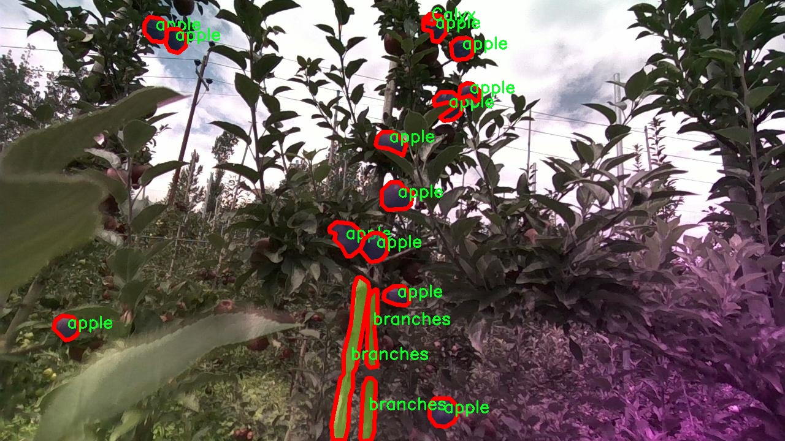

# 苹果树图像分割系统源码＆数据集分享
 [yolov8-seg-C2f-EMBC＆yolov8-seg-C2f-FocusedLinearAttention等50+全套改进创新点发刊_一键训练教程_Web前端展示]

### 1.研究背景与意义

项目参考[ILSVRC ImageNet Large Scale Visual Recognition Challenge](https://gitee.com/YOLOv8_YOLOv11_Segmentation_Studio/projects)

项目来源[AAAI Global Al lnnovation Contest](https://kdocs.cn/l/cszuIiCKVNis)

研究背景与意义

随着全球农业现代化进程的加快，智能农业技术的应用日益广泛。苹果作为全球范围内重要的水果之一，其种植、管理和收获过程中的智能化手段亟待提升。传统的苹果树管理方式依赖于人工经验，效率低下且易受人为因素影响。为了解决这一问题，计算机视觉技术的引入为苹果树的精准管理提供了新的可能性。尤其是图像分割技术在农业领域的应用，能够有效地提取和分析苹果树的各个组成部分，从而为精准农业提供支持。

本研究旨在基于改进的YOLOv8模型，构建一个高效的苹果树图像分割系统。YOLO（You Only Look Once）系列模型以其实时性和高精度而受到广泛关注，而YOLOv8作为其最新版本，具备更强的特征提取能力和更快的推理速度，适合于复杂的农业场景。通过对YOLOv8的改进，我们可以更好地适应苹果树的生长特征和环境变化，提高图像分割的准确性和鲁棒性。

在本研究中，我们使用的数据集包含1100张图像，涵盖了苹果树的五个主要类别：花萼（Calyx）、苹果（apple）、树枝（branches）、部分左侧（partially_left）和部分右侧（partially_right）。这些类别的划分不仅反映了苹果树的生物学特征，也为后续的图像分析提供了丰富的信息基础。通过对这些类别的精准分割，我们能够深入理解苹果树的生长状态、果实的成熟度以及树木的健康状况，从而为果农提供科学的管理建议。

本研究的意义在于，不仅为苹果树的精准管理提供了一种新的技术手段，还为其他水果和植物的图像分割研究提供了借鉴。通过改进YOLOv8模型，我们能够实现对苹果树各个部分的高效识别和分割，为后续的自动化管理、病虫害监测和产量预测奠定基础。此外，研究结果还可以为农业机器人和无人机的应用提供数据支持，推动智能农业的进一步发展。

综上所述，基于改进YOLOv8的苹果树图像分割系统的研究，不仅具有重要的理论价值，还具备广泛的实际应用前景。通过这一研究，我们期望能够为苹果种植者提供更为精准的管理工具，提升苹果的产量和质量，同时为智能农业的发展贡献一份力量。

### 2.图片演示







##### 注意：由于此博客编辑较早，上面“2.图片演示”和“3.视频演示”展示的系统图片或者视频可能为老版本，新版本在老版本的基础上升级如下：（实际效果以升级的新版本为准）

  （1）适配了YOLOV8的“目标检测”模型和“实例分割”模型，通过加载相应的权重（.pt）文件即可自适应加载模型。

  （2）支持“图片识别”、“视频识别”、“摄像头实时识别”三种识别模式。

  （3）支持“图片识别”、“视频识别”、“摄像头实时识别”三种识别结果保存导出，解决手动导出（容易卡顿出现爆内存）存在的问题，识别完自动保存结果并导出到tempDir中。

  （4）支持Web前端系统中的标题、背景图等自定义修改，后面提供修改教程。

  另外本项目提供训练的数据集和训练教程,暂不提供权重文件（best.pt）,需要您按照教程进行训练后实现图片演示和Web前端界面演示的效果。

### 3.视频演示

[3.1 视频演示](https://www.bilibili.com/video/BV1LtyhYwEUF/)

### 4.数据集信息展示

##### 4.1 本项目数据集详细数据（类别数＆类别名）

nc: 5
names: ['Calyx', 'apple', 'branches', 'partially_left', 'partially_right']


##### 4.2 本项目数据集信息介绍

数据集信息展示

在本研究中，我们采用了名为“Apple_Project_Finall”的数据集，以训练和改进YOLOv8-seg模型，旨在实现高效的苹果树图像分割系统。该数据集的设计充分考虑了苹果树的生长特征和环境因素，旨在为模型提供丰富的样本，以提升其在实际应用中的表现。数据集包含五个主要类别，分别是“Calyx”、“apple”、“branches”、“partially_left”和“partially_right”。这些类别的选择不仅反映了苹果树的结构特征，还考虑了在不同生长阶段和环境条件下，苹果树的外观变化。

首先，类别“Calyx”代表了苹果果实的萼片部分，这一部分在图像分割中至关重要，因为它不仅影响果实的外观，还与果实的生长和成熟密切相关。通过准确识别和分割Calyx，模型能够更好地理解果实的生长状态，为后续的果实管理和采摘提供数据支持。

其次，类别“apple”则是数据集中最为核心的部分，直接对应于苹果果实本身。该类别的样本涵盖了不同品种、不同成熟度以及不同光照条件下的苹果图像。这种多样性使得模型能够学习到更为复杂的特征，从而在实际应用中实现更高的识别准确率。苹果的外观特征变化多端，因此，数据集中包含的多样化样本将极大地提升模型的泛化能力。

类别“branches”则关注于苹果树的枝干部分。枝干不仅是苹果树的支撑结构，还与树木的生长习性、光合作用等生物学特性密切相关。通过对枝干的有效分割，模型能够更好地理解苹果树的整体结构，为后续的生长监测和管理提供基础数据。此外，枝干的健康状况直接影响果实的产量和质量，因此，准确识别和分析枝干信息对于果园管理至关重要。

而“partially_left”和“partially_right”这两个类别则专注于部分可见的苹果果实。这一设计考虑到了在实际拍摄过程中，因光照、角度或遮挡等因素导致的果实部分可见的情况。通过对这些部分可见果实的分割，模型能够在复杂的环境中依然保持较高的识别能力，从而提升系统的实用性和可靠性。

综上所述，“Apple_Project_Finall”数据集通过精心设计的类别设置，为改进YOLOv8-seg模型提供了丰富的训练样本。每个类别不仅在数量上具有一定的代表性，更在特征上涵盖了苹果树生长的各个方面。这种全面的类别划分和多样化的样本来源，将为苹果树图像分割系统的训练提供坚实的基础，进而推动智能农业的发展，提高果园管理的效率和精确度。通过对该数据集的深入分析和利用，我们期待能够实现更为精准的苹果树图像分割，为农业生产提供更为科学的数据支持。











### 5.全套项目环境部署视频教程（零基础手把手教学）

[5.1 环境部署教程链接（零基础手把手教学）](https://www.bilibili.com/video/BV1jG4Ve4E9t/?vd_source=bc9aec86d164b67a7004b996143742dc)


[5.2 安装Python虚拟环境创建和依赖库安装视频教程链接（零基础手把手教学）](https://www.bilibili.com/video/BV1nA4VeYEze/?vd_source=bc9aec86d164b67a7004b996143742dc)

### 6.手把手YOLOV8-seg训练视频教程（零基础小白有手就能学会）

[6.1 手把手YOLOV8-seg训练视频教程（零基础小白有手就能学会）](https://www.bilibili.com/video/BV1cA4VeYETe/?vd_source=bc9aec86d164b67a7004b996143742dc)


按照上面的训练视频教程链接加载项目提供的数据集，运行train.py即可开始训练



     Epoch   gpu_mem       box       obj       cls    labels  img_size
     1/200     0G   0.01576   0.01955  0.007536        22      1280: 100%|██████████| 849/849 [14:42<00:00,  1.04s/it]
               Class     Images     Labels          P          R     mAP@.5 mAP@.5:.95: 100%|██████████| 213/213 [01:14<00:00,  2.87it/s]
                 all       3395      17314      0.994      0.957      0.0957      0.0843

     Epoch   gpu_mem       box       obj       cls    labels  img_size
     2/200     0G   0.01578   0.01923  0.007006        22      1280: 100%|██████████| 849/849 [14:44<00:00,  1.04s/it]
               Class     Images     Labels          P          R     mAP@.5 mAP@.5:.95: 100%|██████████| 213/213 [01:12<00:00,  2.95it/s]
                 all       3395      17314      0.996      0.956      0.0957      0.0845

     Epoch   gpu_mem       box       obj       cls    labels  img_size
     3/200     0G   0.01561    0.0191  0.006895        27      1280: 100%|██████████| 849/849 [10:56<00:00,  1.29it/s]
               Class     Images     Labels          P          R     mAP@.5 mAP@.5:.95: 100%|███████   | 187/213 [00:52<00:00,  4.04it/s]
                 all       3395      17314      0.996      0.957      0.0957      0.0845


### 7.50+种全套YOLOV8-seg创新点代码加载调参视频教程（一键加载写好的改进模型的配置文件）

[7.1 50+种全套YOLOV8-seg创新点代码加载调参视频教程（一键加载写好的改进模型的配置文件）](https://www.bilibili.com/video/BV1Hw4VePEXv/?vd_source=bc9aec86d164b67a7004b996143742dc)

### 8.YOLOV8-seg图像分割算法原理

原始YOLOv8-seg算法原理

YOLOv8-seg算法是YOLO系列中的最新版本，专注于目标检测与实例分割任务。该算法在YOLOv5的基础上进行了多项优化与升级，旨在提升检测精度与速度，同时保持模型的轻量化特性。YOLOv8-seg不仅继承了前代模型的优点，还引入了新的设计理念和技术，使其在计算机视觉领域中表现出色。

YOLOv8-seg的网络结构主要由四个部分组成：输入端、骨干网络、颈部网络和头部网络。输入端负责数据的预处理，包括马赛克数据增强、自适应锚框计算和自适应灰度填充等。这些技术能够有效提高模型对不同场景的适应能力，增强数据的多样性，从而提升模型的泛化能力。

在骨干网络部分，YOLOv8-seg采用了C2f模块替代了传统的C3模块。C2f模块通过引入更多的跳层连接和分支结构，显著增强了特征的表达能力和梯度流动性。这种设计使得网络能够更好地捕捉到不同层次的特征信息，从而提高了目标检测的准确性。此外，YOLOv8-seg在卷积层的设计上进行了优化，将卷积核的大小从6x6减小到3x3，进一步减轻了模型的计算负担。

颈部网络部分则采用了路径聚合网络（PAN）结构，这一结构的引入旨在加强不同尺度特征的融合能力。PAN通过高效的特征传递机制，能够更好地整合来自不同层次的特征信息，确保模型在处理多尺度目标时的鲁棒性。为了进一步提升特征融合的效率，YOLOv8-seg还引入了BiFPN（双向特征金字塔网络），实现了高效的双向跨尺度连接和加权特征融合。这种设计使得模型在提取不同尺度特征信息时更加迅速，进而提高了整体的检测性能。

在头部网络方面，YOLOv8-seg采用了解耦头结构，替代了传统的耦合头。这一创新使得分类和回归过程得以分离，简化了损失计算的过程。具体而言，YOLOv8-seg使用Task-Aligned Assigner策略，根据分类与回归的分数加权结果选择正样本，优化了正负样本的分配。此外，分类分支采用了二元交叉熵损失（BCELoss），而回归分支则结合了分布焦点损失（DFLoss）和完全交并比损失（CIOULoss），这两者的结合显著提升了模型对边界框预测的精准性。

YOLOv8-seg的另一个重要特点是其轻量化设计。为了保证算法的实时性和模型大小可控，YOLOv8-seg在各个模块中都进行了精简与优化。特别是在特征融合层中，减少了降采样层的数量，进一步提升了模型的处理速度。YOLOv8n版本作为YOLOv8系列中参数量最小、检测速度最快的模型，成为了许多实际应用中的首选。

值得一提的是，YOLOv8-seg在处理小目标和高分辨率图像方面表现尤为突出。通过对模型结构的精细调整，YOLOv8-seg能够在复杂场景中有效识别和分割小目标，这一特性在许多实际应用中具有重要意义。此外，YOLOv8-seg还支持姿态评估，进一步扩展了其应用范围。

总的来说，YOLOv8-seg算法通过对网络结构的深度优化和创新，结合了轻量化设计和高效的特征融合策略，极大地提升了目标检测与实例分割的性能。无论是在精度、速度还是在适应性方面，YOLOv8-seg都展现出了强大的能力，成为计算机视觉领域中一个重要的里程碑。随着技术的不断进步，YOLOv8-seg无疑将在更多的实际应用中发挥其潜力，推动目标检测与实例分割技术的发展。


### 9.系统功能展示（检测对象为举例，实际内容以本项目数据集为准）

图9.1.系统支持检测结果表格显示

  图9.2.系统支持置信度和IOU阈值手动调节

  图9.3.系统支持自定义加载权重文件best.pt(需要你通过步骤5中训练获得)

  图9.4.系统支持摄像头实时识别

  图9.5.系统支持图片识别

  图9.6.系统支持视频识别

  图9.7.系统支持识别结果文件自动保存

  图9.8.系统支持Excel导出检测结果数据


### 10.50+种全套YOLOV8-seg创新点原理讲解（非科班也可以轻松写刊发刊，V11版本正在科研待更新）

#### 10.1 由于篇幅限制，每个创新点的具体原理讲解就不一一展开，具体见下列网址中的创新点对应子项目的技术原理博客网址【Blog】：


[10.1 50+种全套YOLOV8-seg创新点原理讲解链接](https://gitee.com/qunmasj/good)

#### 10.2 部分改进模块原理讲解(完整的改进原理见上图和技术博客链接)【如果此小节的图加载失败可以通过CSDN或者Github搜索该博客的标题访问原始博客，原始博客图片显示正常】
### YOLOv8简介
YOLO（You Only Look Once）是一种流行的对象检测和图像分割模型，由华盛顿大学的Joseph Redmon和Ali Farhadi开发。YOLO于2015年推出，以其高速度和高精度迅速走红。

YOLOv2于2016年发布，通过合并批处理规范化、锚盒和维度集群来改进原始模型
2018年推出的YOLOv3使用更高效的骨干网络、多个锚点和空间金字塔池进一步增强了该模型的性能
YOLOv4于2020年发布，引入了Mosaic数据增强、新的无锚检测头和新的丢失功能等创新
YOLOv5进一步提高了模型的性能，并添加了超参数优化、集成实验跟踪和自动导出到流行导出格式等新功能
YOLOv6于2022年由美团开源，目前正在该公司的许多自动配送机器人中使用
YOLOv7在COCO关键点数据集上添加了额外的任务，如姿态估计
YOLOv8是Ultralytics公司推出的YOLO的最新版本。作为一款尖端、最先进的（SOTA）车型，YOLOv8在之前版本的成功基础上，引入了新的功能和改进，以增强性能、灵活性和效率。YOLOv8支持全方位的视觉AI任务，包括检测、分割、姿态估计、跟踪和分类。这种多功能性允许用户在不同的应用程序和域中利用YOLOv8的功能
#### YOLOv8的新特性与可用模型

Ultralytics 并没有直接将开源库命名为 YOLOv8，而是直接使用 ultralytics 这个词，原因是 ultralytics 将这个库定位为算法框架，而非某一个特定算法，一个主要特点是可扩展性。其希望这个库不仅仅能够用于 YOLO 系列模型，而是能够支持非 YOLO 模型以及分类分割姿态估计等各类任务。总而言之，ultralytics 开源库的两个主要优点是：

融合众多当前 SOTA 技术于一体
未来将支持其他 YOLO 系列以及 YOLO 之外的更多算法
Ultralytics为YOLO模型发布了一个全新的存储库。它被构建为 用于训练对象检测、实例分割和图像分类模型的统一框架。

提供了一个全新的 SOTA 模型，包括 P5 640 和 P6 1280 分辨率的目标检测网络和基于 YOLACT 的实例分割模型。和 YOLOv5 一样，基于缩放系数也提供了 N/S/M/L/X 尺度的不同大小模型，用于满足不同场景需求
骨干网络和 Neck 部分可能参考了 YOLOv7 ELAN 设计思想，将 YOLOv5 的 C3 结构换成了梯度流更丰富的 C2f 结构，并对不同尺度模型调整了不同的通道数，属于对模型结构精心微调，不再是无脑一套参数应用所有模型，大幅提升了模型性能。不过这个 C2f 模块中存在 Split 等操作对特定硬件部署没有之前那么友好了
Head 部分相比 YOLOv5 改动较大，换成了目前主流的解耦头结构，将分类和检测头分离，同时也从 Anchor-Based 换成了 Anchor-Free
Loss 计算方面采用了 TaskAlignedAssigner 正样本分配策略，并引入了 Distribution Focal Loss
训练的数据增强部分引入了 YOLOX 中的最后 10 epoch 关闭 Mosiac 增强的操作，可以有效地提升精度
YOLOv8 还高效灵活地支持多种导出格式，并且该模型可以在 CPU 和 GPU 上运行。YOLOv8 模型的每个类别中有五个模型用于检测、分割和分类。YOLOv8 Nano 是最快和最小的，而 YOLOv8 Extra Large (YOLOv8x) 是其中最准确但最慢的。


### FocalModulation模型的基本原理
参考该博客，Focal Modulation Networks（FocalNets）的基本原理是替换自注意力（Self-Attention）模块，使用焦点调制（focal modulation）机制来捕捉图像中的长距离依赖和上下文信息。下图是自注意力和焦点调制两种方法的对比。


自注意力要求对每个查询令牌（Query Token）与其他令牌进行复杂的查询-键（Query-Key）交互和查询-值（Query-Value）聚合，以计算注意力分数并捕捉上下文。而焦点调制则先将空间上下文以不同粒度聚合到调制器中，然后以查询依赖的方式将这些调制器注入到查询令牌中。焦点调制简化了交互和聚合操作，使其更轻量级。在图中，自注意力部分使用红色虚线表示查询-键交互和黄色虚线表示查询-值聚合，而焦点调制部分则用蓝色表示调制器聚合和黄色表示查询-调制器交互。 

FocalModulation模型通过以下步骤实现：

1. 焦点上下文化：用深度卷积层堆叠来编码不同范围的视觉上下文。


2. 门控聚合：通过门控机制，选择性地将上下文信息聚合到每个查询令牌的调制器中。


3. 逐元素仿射变换：将聚合后的调制器通过仿射变换注入到每个查询令牌中。

下面来分别介绍这三个机制->

#### 焦点上下文化
焦点上下文化（Focal Contextualization）是焦点调制（Focal Modulation）的一个组成部分。焦点上下文化使用一系列深度卷积层（depth-wise convolutional layers）来编码不同范围内的视觉上下文信息。这些层可以捕捉从近处到远处的视觉特征，从而允许网络在不同层次上理解图像内容。通过这种方式，网络能够在聚合上下文信息时保持对局部细节的敏感性，并增强对全局结构的认识。


​

这张图详细比较了自注意力（Self-Attention, SA）和焦点调制（Focal Modulation）的机制，并特别展示了焦点调制中的上下文聚合过程。左侧的图展示了自注意力模型如何通过键（k）和查询（q）之间的交互，以及随后的聚合来生成输出。而中间和右侧的图说明了焦点调制如何通过层级化的上下文聚合和门控聚合过程替代自注意力模型的这一过程。在焦点调制中，输入首先通过轻量级线性层进行处理，然后通过层级化的上下文化模块和门控机制来选择性地聚合信息，最终通过调制器与查询（q）进行交互以生成输出。

#### 门控聚合
在Focal Modulation Networks（FocalNets）中的 "门控聚合"（Gated Aggregation）是关键组件之一，这一过程涉及使用门控机制来选择性地聚合上下文信息。以下是这个过程的详细分析：

1. 什么是门控机制？
门控机制在深度学习中常用于控制信息流。它通常用于决定哪些信息应该被传递，哪些应该被阻断。在循环神经网络（RNN）中，特别是在长短期记忆网络（LSTM）和门控循环单元（GRU）中，门控机制用于调节信息在时间序列数据中的流动。

2. 门控聚合的目的
在FocalNets中，门控聚合的目的是为每个查询令牌（即处理中的数据单元）选择性地聚合上下文信息。这意味着网络能够决定哪些特定的上下文信息对于当前处理的查询令牌是重要的，从而专注于那些最相关的信息。

3. 如何实现门控聚合？
实现门控聚合可能涉及一系列计算步骤，其中包括：

计算上下文信息：这可能涉及使用深度卷积层（如文中提到的）对输入图像的不同区域进行编码，以捕捉从局部到全局的视觉上下文。
门控操作：这一步骤涉及到一个决策过程，根据当前查询令牌的特征来决定哪些上下文信息是相关的。这可能通过一个学习到的权重（门）来实现，该权重决定了不同上下文信息的重要性。
信息聚合：最后，根据门控操作的结果，选择性地聚合上下文信息到一个调制器中。这个调制器随后被用于调整或“调制”查询令牌的表示。
4. 门控聚合的好处
通过门控聚合，FocalNets能够更有效地聚焦于对当前任务最关键的信息。这种方法提高了模型的效率和性能，因为它减少了不必要信息的处理，同时增强了对关键特征的关注。在视觉任务中，这可能意味着更好的目标检测和图像分类性能，特别是在复杂或多变的视觉环境中。

总结：门控聚合是FocalNets的一个核心组成部分，它通过选择性地集中处理重要的上下文信息来提升网络的效率和性能。

#### 逐元素仿射变换
在Focal Modulation Networks（FocalNets）中的第三个关键组件是逐元素仿射变换，这个步骤涉及将通过门控聚合得到的调制器注入到每个查询令牌中。以下是该过程的详细分析：

1. 仿射变换的基本概念：
仿射变换是一种线性变换，用于对数据进行缩放、旋转、平移和倾斜等操作。在深度学习中，逐元素的仿射变换通常指的是对每个元素进行线性变换，这种变换可以被描述为y = ax + b，其中x是输入，y是输出，a和b是变换的参数。

2. 逐元素仿射变换的作用：
在FocalNets中，逐元素仿射变换的作用是将聚合后的调制器信息注入到每个查询令牌中。这个步骤对于整合上下文信息和查询令牌的原始特征非常重要。通过这种方式，调制器所包含的上下文信息可以直接影响查询令牌的表示。

3. 执行仿射变换：
执行这一步骤时，聚合后的调制器对每个查询令牌进行逐元素的仿射变换。在实践中，这可能意味着对查询令牌的每个特征应用调制器中的相应权重（a）和偏差（b）。这样，调制器中的每个元素都直接对应于查询令牌的一个特征，通过调整这些特征来改变其表达。

4. 仿射变换的效果：
通过逐元素仿射变换，模型能够更细致地调整每个查询令牌的特征，根据上下文信息来增强或抑制某些特征。这种精细的调整机制允许网络更好地适应复杂的视觉场景，提高对细节的捕捉能力，从而提升了模型在各种视觉任务中的性能，如目标检测和图像分类。

总结：逐元素仿射变换它使得模型能够利用上下文信息来有效地调整查询令牌，增强了模型对关键视觉特征的捕捉和表达能力。


### 11.项目核心源码讲解（再也不用担心看不懂代码逻辑）

#### 11.1 ui.py

以下是经过简化和注释的核心代码部分：

```python
import sys
import subprocess

def run_script(script_path):
    """
    使用当前 Python 环境运行指定的脚本。

    Args:
        script_path (str): 要运行的脚本路径
    """
    # 获取当前 Python 解释器的路径
    python_path = sys.executable

    # 构建运行命令，使用 streamlit 运行指定的脚本
    command = f'"{python_path}" -m streamlit run "{script_path}"'

    # 执行命令并等待其完成
    result = subprocess.run(command, shell=True)
    
    # 检查命令执行结果，如果返回码不为0，则表示出错
    if result.returncode != 0:
        print("脚本运行出错。")

# 主程序入口
if __name__ == "__main__":
    # 指定要运行的脚本路径
    script_path = "web.py"  # 这里可以直接使用相对路径

    # 调用函数运行脚本
    run_script(script_path)
```

### 代码分析与注释：

1. **导入模块**：
   - `sys`：用于访问与 Python 解释器相关的变量和函数。
   - `subprocess`：用于执行外部命令。

2. **`run_script` 函数**：
   - 该函数接收一个脚本路径作为参数，并在当前 Python 环境中运行该脚本。
   - 使用 `sys.executable` 获取当前 Python 解释器的路径，以确保脚本在正确的环境中运行。
   - 构建一个命令字符串，使用 `streamlit` 模块运行指定的脚本。
   - `subprocess.run` 用于执行构建的命令，并等待其完成。
   - 检查命令的返回码，如果不为0，表示脚本运行出错，并打印错误信息。

3. **主程序入口**：
   - 通过 `if __name__ == "__main__":` 确保只有在直接运行该脚本时才会执行以下代码。
   - 指定要运行的脚本路径（这里是 `web.py`）。
   - 调用 `run_script` 函数，传入脚本路径以执行该脚本。 

这样，代码保留了核心功能，并且每个部分都有详细的中文注释，便于理解。

这个程序文件 `ui.py` 的主要功能是通过当前的 Python 环境来运行一个指定的脚本，具体来说是一个名为 `web.py` 的脚本。程序首先导入了必要的模块，包括 `sys`、`os` 和 `subprocess`，这些模块分别用于获取系统信息、操作系统功能和执行外部命令。

在文件中定义了一个名为 `run_script` 的函数，该函数接受一个参数 `script_path`，表示要运行的脚本的路径。函数内部首先获取当前 Python 解释器的路径，这样可以确保使用的是正确的 Python 环境。接着，构建了一个命令字符串，该命令使用 `streamlit` 模块来运行指定的脚本。`streamlit` 是一个用于构建数据应用的框架。

然后，使用 `subprocess.run` 方法执行构建好的命令。这个方法会在一个新的进程中运行命令，并等待其完成。如果脚本运行过程中出现错误，返回的结果码将不为零，程序会打印出“脚本运行出错”的提示信息。

在文件的最后部分，使用 `if __name__ == "__main__":` 语句来确保当这个文件作为主程序运行时，才会执行下面的代码。这里指定了要运行的脚本路径为 `web.py`，并调用 `run_script` 函数来执行这个脚本。

总的来说，这个程序的作用是简化了通过命令行运行 `web.py` 脚本的过程，使得用户可以直接通过执行 `ui.py` 来启动相应的应用。

#### 11.2 ultralytics\utils\callbacks\base.py

以下是代码中最核心的部分，并附上详细的中文注释：

```python
from collections import defaultdict
from copy import deepcopy

# 默认回调函数字典，包含了训练、验证、预测和导出过程中的各种回调函数
default_callbacks = {
    # 训练过程中的回调
    'on_pretrain_routine_start': [lambda trainer: None],  # 预训练开始时调用
    'on_train_start': [lambda trainer: None],  # 训练开始时调用
    'on_train_epoch_start': [lambda trainer: None],  # 每个训练周期开始时调用
    'on_train_batch_start': [lambda trainer: None],  # 每个训练批次开始时调用
    'optimizer_step': [lambda trainer: None],  # 优化器更新步骤时调用
    'on_before_zero_grad': [lambda trainer: None],  # 在梯度归零之前调用
    'on_train_batch_end': [lambda trainer: None],  # 每个训练批次结束时调用
    'on_train_epoch_end': [lambda trainer: None],  # 每个训练周期结束时调用
    'on_train_end': [lambda trainer: None],  # 训练结束时调用
    
    # 验证过程中的回调
    'on_val_start': [lambda validator: None],  # 验证开始时调用
    'on_val_batch_start': [lambda validator: None],  # 每个验证批次开始时调用
    'on_val_batch_end': [lambda validator: None],  # 每个验证批次结束时调用
    'on_val_end': [lambda validator: None],  # 验证结束时调用
    
    # 预测过程中的回调
    'on_predict_start': [lambda predictor: None],  # 预测开始时调用
    'on_predict_batch_start': [lambda predictor: None],  # 每个预测批次开始时调用
    'on_predict_batch_end': [lambda predictor: None],  # 每个预测批次结束时调用
    'on_predict_end': [lambda predictor: None],  # 预测结束时调用
    
    # 导出过程中的回调
    'on_export_start': [lambda exporter: None],  # 导出开始时调用
    'on_export_end': [lambda exporter: None],  # 导出结束时调用
}

def get_default_callbacks():
    """
    返回一个包含默认回调函数的字典副本，字典的默认值为列表。

    返回:
        (defaultdict): 一个 defaultdict，包含来自 default_callbacks 的键和空列表作为默认值。
    """
    return defaultdict(list, deepcopy(default_callbacks))

def add_integration_callbacks(instance):
    """
    将来自不同来源的集成回调添加到实例的回调中。

    参数:
        instance (Trainer, Predictor, Validator, Exporter): 一个具有 'callbacks' 属性的对象，该属性是一个回调列表的字典。
    """
    # 加载 HUB 回调
    from .hub import callbacks as hub_cb
    callbacks_list = [hub_cb]

    # 如果实例是 Trainer 类，则加载训练相关的回调
    if 'Trainer' in instance.__class__.__name__:
        from .clearml import callbacks as clear_cb
        from .comet import callbacks as comet_cb
        from .dvc import callbacks as dvc_cb
        from .mlflow import callbacks as mlflow_cb
        from .neptune import callbacks as neptune_cb
        from .raytune import callbacks as tune_cb
        from .tensorboard import callbacks as tb_cb
        from .wb import callbacks as wb_cb
        callbacks_list.extend([clear_cb, comet_cb, dvc_cb, mlflow_cb, neptune_cb, tune_cb, tb_cb, wb_cb])

    # 将回调添加到回调字典中
    for callbacks in callbacks_list:
        for k, v in callbacks.items():
            if v not in instance.callbacks[k]:
                instance.callbacks[k].append(v)
```

### 代码说明：
1. **default_callbacks**: 这是一个字典，定义了在不同训练、验证、预测和导出阶段的回调函数。每个阶段都有特定的回调函数，用于在相应的事件发生时执行特定的操作。

2. **get_default_callbacks**: 这个函数返回一个 `defaultdict`，其默认值为列表，包含了 `default_callbacks` 的副本。这样可以确保每次调用时都得到一个新的字典，避免对原始字典的修改。

3. **add_integration_callbacks**: 这个函数用于将来自不同库或模块的回调函数集成到给定实例的回调字典中。根据实例的类型（如 `Trainer`），它会加载相应的回调并将其添加到实例的回调列表中。这样可以扩展功能，支持更多的回调集成。

这个程序文件 `ultralytics/utils/callbacks/base.py` 是用于定义一系列回调函数的基础模块，主要用于训练、验证、预测和导出模型的不同阶段。回调函数是一种在特定事件发生时自动调用的函数，常用于监控和控制训练过程。

文件首先导入了 `defaultdict` 和 `deepcopy`，这两个模块分别用于创建具有默认值的字典和深拷贝对象。接下来，定义了一系列回调函数，这些函数在特定的训练、验证、预测和导出阶段被调用。每个回调函数的实现目前都是空的，意味着它们可以在后续的开发中被具体实现，以便在对应的事件发生时执行特定的操作。

在训练阶段，回调函数包括：
- `on_pretrain_routine_start` 和 `on_pretrain_routine_end`：在预训练开始和结束时调用。
- `on_train_start`：训练开始时调用。
- `on_train_epoch_start` 和 `on_train_epoch_end`：每个训练周期开始和结束时调用。
- `on_train_batch_start` 和 `on_train_batch_end`：每个训练批次开始和结束时调用。
- `optimizer_step`：优化器更新参数时调用。
- `on_before_zero_grad`：在梯度归零之前调用。
- `on_fit_epoch_end`：在每个训练和验证周期结束时调用。
- `on_model_save`：模型保存时调用。
- `on_train_end`：训练结束时调用。
- `on_params_update`：模型参数更新时调用。
- `teardown`：训练过程结束时的清理工作。

在验证阶段，回调函数包括：
- `on_val_start` 和 `on_val_end`：验证开始和结束时调用。
- `on_val_batch_start` 和 `on_val_batch_end`：每个验证批次开始和结束时调用。

在预测阶段，回调函数包括：
- `on_predict_start` 和 `on_predict_end`：预测开始和结束时调用。
- `on_predict_batch_start` 和 `on_predict_batch_end`：每个预测批次开始和结束时调用。
- `on_predict_postprocess_end`：预测后处理结束时调用。

在导出阶段，回调函数包括：
- `on_export_start` 和 `on_export_end`：模型导出开始和结束时调用。

接下来，定义了一个 `default_callbacks` 字典，映射了各个事件到相应的回调函数列表。这个字典为不同的阶段提供了默认的回调函数。

`get_default_callbacks` 函数返回一个深拷贝的 `default_callbacks` 字典，确保返回的字典可以独立于原始字典进行修改。

`add_integration_callbacks` 函数用于将来自不同来源的集成回调添加到实例的回调字典中。该函数首先导入了一些外部回调模块，然后根据实例的类型（如 Trainer、Predictor、Validator、Exporter）加载相应的回调，并将它们添加到实例的回调字典中，确保每个回调只被添加一次。

总的来说，这个文件为模型训练、验证、预测和导出过程中的事件提供了一个灵活的回调机制，便于用户在不同阶段插入自定义逻辑。

#### 11.3 ultralytics\models\sam\build.py

以下是经过简化并添加详细中文注释的核心代码部分：

```python
import torch
from ultralytics.utils.downloads import attempt_download_asset
from .modules.decoders import MaskDecoder
from .modules.encoders import ImageEncoderViT, PromptEncoder
from .modules.sam import Sam
from .modules.tiny_encoder import TinyViT
from .modules.transformer import TwoWayTransformer

def _build_sam(encoder_embed_dim,
               encoder_depth,
               encoder_num_heads,
               encoder_global_attn_indexes,
               checkpoint=None,
               mobile_sam=False):
    """构建指定的SAM模型架构。"""
    
    # 定义提示嵌入维度和图像相关参数
    prompt_embed_dim = 256
    image_size = 1024
    vit_patch_size = 16
    image_embedding_size = image_size // vit_patch_size  # 计算图像嵌入大小

    # 根据是否为移动SAM选择不同的图像编码器
    image_encoder = (TinyViT(
        img_size=1024,
        in_chans=3,
        num_classes=1000,
        embed_dims=encoder_embed_dim,
        depths=encoder_depth,
        num_heads=encoder_num_heads,
        window_sizes=[7, 7, 14, 7],
        mlp_ratio=4.0,
        drop_rate=0.0,
        drop_path_rate=0.0,
        use_checkpoint=False,
        mbconv_expand_ratio=4.0,
        local_conv_size=3,
    ) if mobile_sam else ImageEncoderViT(
        depth=encoder_depth,
        embed_dim=encoder_embed_dim,
        img_size=image_size,
        mlp_ratio=4,
        norm_layer=partial(torch.nn.LayerNorm, eps=1e-6),
        num_heads=encoder_num_heads,
        patch_size=vit_patch_size,
        qkv_bias=True,
        use_rel_pos=True,
        global_attn_indexes=encoder_global_attn_indexes,
        window_size=14,
        out_chans=prompt_embed_dim,
    ))

    # 创建SAM模型
    sam = Sam(
        image_encoder=image_encoder,
        prompt_encoder=PromptEncoder(
            embed_dim=prompt_embed_dim,
            image_embedding_size=(image_embedding_size, image_embedding_size),
            input_image_size=(image_size, image_size),
            mask_in_chans=16,
        ),
        mask_decoder=MaskDecoder(
            num_multimask_outputs=3,
            transformer=TwoWayTransformer(
                depth=2,
                embedding_dim=prompt_embed_dim,
                mlp_dim=2048,
                num_heads=8,
            ),
            transformer_dim=prompt_embed_dim,
            iou_head_depth=3,
            iou_head_hidden_dim=256,
        ),
        pixel_mean=[123.675, 116.28, 103.53],  # 图像预处理的均值
        pixel_std=[58.395, 57.12, 57.375],      # 图像预处理的标准差
    )

    # 如果提供了检查点，则加载模型权重
    if checkpoint is not None:
        checkpoint = attempt_download_asset(checkpoint)  # 尝试下载检查点
        with open(checkpoint, 'rb') as f:
            state_dict = torch.load(f)  # 加载模型状态字典
        sam.load_state_dict(state_dict)  # 将状态字典加载到模型中

    sam.eval()  # 设置模型为评估模式
    return sam  # 返回构建的SAM模型
```

### 代码说明：
1. **导入模块**：导入所需的PyTorch库和其他模块。
2. **_build_sam函数**：该函数用于构建Segment Anything Model（SAM），接受多个参数来定义模型的结构。
   - `encoder_embed_dim`：编码器的嵌入维度。
   - `encoder_depth`：编码器的深度。
   - `encoder_num_heads`：编码器的头数。
   - `encoder_global_attn_indexes`：全局注意力索引。
   - `checkpoint`：可选的模型检查点，用于加载预训练权重。
   - `mobile_sam`：布尔值，指示是否构建移动版本的SAM。
3. **图像编码器选择**：根据`mobile_sam`的值选择不同的图像编码器（TinyViT或ImageEncoderViT）。
4. **创建SAM模型**：使用图像编码器、提示编码器和掩码解码器构建SAM模型。
5. **加载检查点**：如果提供了检查点，则尝试下载并加载模型权重。
6. **返回模型**：最后返回构建好的SAM模型。

这个程序文件主要用于构建“Segment Anything Model”（SAM），这是一个用于图像分割的深度学习模型。文件中包含多个函数，每个函数负责构建不同尺寸的SAM模型，包括高（h）、大（l）、小（b）和移动版（Mobile-SAM）。这些模型的构建涉及到不同的编码器配置，如嵌入维度、深度、头数等。

首先，文件导入了一些必要的库和模块，包括PyTorch和一些自定义的模块（如解码器、编码器等）。接着，定义了多个构建函数，例如`build_sam_vit_h`、`build_sam_vit_l`、`build_sam_vit_b`和`build_mobile_sam`，这些函数调用了一个内部函数`_build_sam`，并传入不同的参数来构建相应的模型。

`_build_sam`函数是核心函数，它根据传入的参数构建具体的SAM模型架构。该函数定义了一些固定的参数，如提示嵌入维度、图像大小和图像编码器的配置。根据是否构建移动版模型，选择不同的编码器（`TinyViT`或`ImageEncoderViT`）。随后，创建了一个SAM实例，其中包含图像编码器、提示编码器和掩码解码器。

如果提供了检查点路径，程序会尝试下载并加载模型的状态字典，以便恢复模型的权重。最后，模型被设置为评估模式，并返回构建好的模型实例。

在文件的最后部分，定义了一个字典`sams_model_map`，该字典将模型文件名映射到相应的构建函数。`build_sam`函数根据给定的检查点名称，查找并调用相应的构建函数，最终返回构建好的SAM模型。如果检查点名称不在支持的模型列表中，则会抛出一个文件未找到的异常。

总体来说，这个文件的主要功能是提供一个灵活的接口来构建不同配置的SAM模型，方便用户根据需求选择合适的模型进行图像分割任务。

#### 11.4 ultralytics\models\yolo\detect\predict.py

以下是代码中最核心的部分，并附上详细的中文注释：

```python
from ultralytics.engine.predictor import BasePredictor
from ultralytics.engine.results import Results
from ultralytics.utils import ops

class DetectionPredictor(BasePredictor):
    """
    DetectionPredictor类，继承自BasePredictor类，用于基于检测模型进行预测。
    """

    def postprocess(self, preds, img, orig_imgs):
        """后处理预测结果，并返回Results对象的列表。"""
        
        # 使用非极大值抑制（NMS）来过滤预测框，去除重叠度高的框
        preds = ops.non_max_suppression(preds,
                                        self.args.conf,  # 置信度阈值
                                        self.args.iou,   # IOU阈值
                                        agnostic=self.args.agnostic_nms,  # 是否进行类别无关的NMS
                                        max_det=self.args.max_det,  # 最大检测框数量
                                        classes=self.args.classes)  # 指定的类别

        # 如果输入的原始图像不是列表，则将其转换为numpy数组
        if not isinstance(orig_imgs, list):  # 输入图像是torch.Tensor，而不是列表
            orig_imgs = ops.convert_torch2numpy_batch(orig_imgs)  # 转换为numpy批量数组

        results = []  # 初始化结果列表
        for i, pred in enumerate(preds):  # 遍历每个预测结果
            orig_img = orig_imgs[i]  # 获取对应的原始图像
            # 将预测框的坐标缩放到原始图像的尺寸
            pred[:, :4] = ops.scale_boxes(img.shape[2:], pred[:, :4], orig_img.shape)
            img_path = self.batch[0][i]  # 获取图像路径
            # 将结果添加到结果列表中
            results.append(Results(orig_img, path=img_path, names=self.model.names, boxes=pred))
        
        return results  # 返回处理后的结果列表
```

### 代码注释说明：
1. **类定义**：`DetectionPredictor`类用于处理检测模型的预测，继承自`BasePredictor`。
2. **后处理方法**：`postprocess`方法用于对模型的预测结果进行后处理，主要包括非极大值抑制（NMS）和坐标缩放。
3. **非极大值抑制**：通过`ops.non_max_suppression`函数，过滤掉重叠度高的预测框，以提高检测精度。
4. **图像格式转换**：检查输入的原始图像格式，如果不是列表，则将其转换为numpy数组，方便后续处理。
5. **结果收集**：遍历每个预测结果，缩放预测框坐标，并将结果封装为`Results`对象，最终返回所有结果的列表。

这个程序文件是Ultralytics YOLO模型中的一个预测模块，主要用于基于检测模型进行目标检测的预测。文件中定义了一个名为`DetectionPredictor`的类，它继承自`BasePredictor`类。这个类的主要功能是处理输入数据并生成预测结果。

在类的文档字符串中，提供了一个使用示例，展示了如何导入`DetectionPredictor`并使用它进行预测。用户可以通过传入模型文件路径和数据源来创建一个预测器实例，并调用`predict_cli()`方法进行预测。

类中定义了一个名为`postprocess`的方法，该方法用于对模型的预测结果进行后处理。具体来说，它接收三个参数：`preds`（模型的原始预测结果）、`img`（输入图像）和`orig_imgs`（原始图像）。在方法内部，首先调用`ops.non_max_suppression`函数对预测结果进行非极大值抑制，以去除冗余的检测框。这个过程使用了一些参数，如置信度阈值、IOU阈值、是否进行类别无关的NMS、最大检测框数量以及需要检测的类别。

接下来，方法检查`orig_imgs`是否为列表，如果不是，则将其转换为NumPy数组。然后，方法会遍历每个预测结果，并根据原始图像的尺寸对预测框进行缩放，以确保框的位置和大小与原始图像相匹配。同时，记录下每个图像的路径，并将原始图像、路径、模型名称和预测框封装成`Results`对象，最终将所有结果以列表的形式返回。

整体来看，这个文件的主要目的是为YOLO模型提供一个高效的预测接口，并通过后处理步骤确保输出结果的准确性和可用性。

#### 11.5 train.py

以下是代码中最核心的部分，并附上详细的中文注释：

```python
import os
import torch
import yaml
from ultralytics import YOLO  # 导入YOLO模型库

if __name__ == '__main__':  # 确保该模块被直接运行时才执行以下代码
    # 设置训练参数
    workers = 1  # 数据加载的工作进程数量
    batch = 8  # 每个批次的样本数量
    device = "0" if torch.cuda.is_available() else "cpu"  # 检查是否有可用的GPU，若没有则使用CPU

    # 获取数据集配置文件的绝对路径
    data_path = abs_path(f'datasets/data/data.yaml', path_type='current')

    # 将路径格式转换为Unix风格
    unix_style_path = data_path.replace(os.sep, '/')
    # 获取数据集所在目录的路径
    directory_path = os.path.dirname(unix_style_path)

    # 读取YAML文件，保持原有顺序
    with open(data_path, 'r') as file:
        data = yaml.load(file, Loader=yaml.FullLoader)

    # 修改YAML文件中的训练、验证和测试数据路径
    if 'train' in data and 'val' in data and 'test' in data:
        data['train'] = directory_path + '/train'  # 设置训练数据路径
        data['val'] = directory_path + '/val'      # 设置验证数据路径
        data['test'] = directory_path + '/test'    # 设置测试数据路径

        # 将修改后的数据写回YAML文件
        with open(data_path, 'w') as file:
            yaml.safe_dump(data, file, sort_keys=False)

    # 加载YOLO模型配置和预训练权重
    model = YOLO(r"C:\codeseg\codenew\50+种YOLOv8算法改进源码大全和调试加载训练教程（非必要）\改进YOLOv8模型配置文件\yolov8-seg-C2f-Faster.yaml").load("./weights/yolov8s-seg.pt")

    # 开始训练模型
    results = model.train(
        data=data_path,  # 指定训练数据的配置文件路径
        device=device,  # 使用指定的设备进行训练
        workers=workers,  # 使用指定数量的工作进程加载数据
        imgsz=640,  # 指定输入图像的大小为640x640
        epochs=100,  # 指定训练的轮数为100
        batch=batch,  # 指定每个批次的样本数量
    )
```

### 代码核心部分说明：
1. **导入必要的库**：导入`os`、`torch`、`yaml`和YOLO模型库。
2. **设置训练参数**：定义数据加载的工作进程数量、批次大小和设备类型（GPU或CPU）。
3. **获取数据集配置文件路径**：通过`abs_path`函数获取数据集的YAML配置文件的绝对路径，并转换为Unix风格路径。
4. **读取和修改YAML文件**：读取YAML文件内容，修改训练、验证和测试数据的路径，并将修改后的内容写回文件。
5. **加载YOLO模型**：使用指定的配置文件和预训练权重加载YOLO模型。
6. **开始训练模型**：调用`model.train`方法开始训练，传入数据路径、设备、工作进程数量、图像大小、训练轮数和批次大小等参数。

这个程序文件`train.py`主要用于训练YOLO（You Only Look Once）模型，具体是YOLOv8的一个变种，主要用于目标检测或分割任务。程序首先导入了一些必要的库，包括`os`、`torch`、`yaml`和`matplotlib`，其中`ultralytics`库提供了YOLO模型的实现。

在`__main__`模块中，程序首先设置了一些训练参数，包括工作进程数`workers`、批次大小`batch`和设备类型`device`。设备类型会根据是否有可用的GPU（通过`torch.cuda.is_available()`来判断）来决定，如果有则使用GPU，否则使用CPU。批次大小可以根据计算机的显存和内存情况进行调整，如果出现显存不足的情况，可以适当降低这个值。

接下来，程序通过`abs_path`函数获取数据集配置文件的绝对路径，该配置文件是一个YAML格式的文件，包含了训练、验证和测试数据的路径。程序将路径中的分隔符统一替换为Unix风格的斜杠，以确保在不同操作系统下路径的兼容性。

程序打开YAML文件并读取其内容，使用`yaml.load`方法保持原有的顺序。然后，程序检查YAML文件中是否包含`train`、`val`和`test`这几个键，如果有，则将这些键对应的路径修改为当前目录下的`train`、`val`和`test`文件夹，并将修改后的内容写回到YAML文件中。

接下来，程序加载YOLO模型的配置文件和预训练权重。这里的模型配置文件路径是硬编码的，用户可以根据需要修改为其他模型的配置文件。模型加载完成后，程序调用`model.train`方法开始训练，传入的数据配置文件路径、设备类型、工作进程数、输入图像大小（640x640）、训练的轮数（100个epoch）和批次大小等参数。

整个程序的结构清晰，主要分为数据准备、模型加载和训练三个部分，适合用于YOLO模型的训练任务。用户在使用时需要确保数据集的路径和模型配置文件的路径正确，并根据自己的硬件条件调整相关参数。

#### 11.6 ultralytics\nn\extra_modules\kernel_warehouse.py

以下是经过简化和注释的核心代码部分：

```python
import torch
import torch.nn as nn
import torch.nn.functional as F

class Attention(nn.Module):
    def __init__(self, in_planes, reduction, num_static_cell, num_local_mixture, norm_layer=nn.BatchNorm1d):
        super(Attention, self).__init__()
        # 计算隐藏层的通道数
        hidden_planes = max(int(in_planes * reduction), 16)
        self.kw_planes_per_mixture = num_static_cell + 1  # 每个混合的通道数
        self.num_local_mixture = num_local_mixture  # 本地混合数
        self.kw_planes = self.kw_planes_per_mixture * num_local_mixture  # 总通道数

        # 定义网络层
        self.avgpool = nn.AdaptiveAvgPool1d(1)  # 自适应平均池化
        self.fc1 = nn.Linear(in_planes, hidden_planes)  # 全连接层1
        self.norm1 = norm_layer(hidden_planes)  # 归一化层
        self.act1 = nn.ReLU(inplace=True)  # 激活函数

        # 全连接层2和3
        self.fc2 = nn.Linear(hidden_planes, self.kw_planes)  # 全连接层2
        self.fc3 = nn.Linear(hidden_planes, num_static_cell)  # 全连接层3

        self.temp_bias = torch.zeros([self.kw_planes], requires_grad=False)  # 温度偏置
        self.temp_value = 0  # 温度值
        self._initialize_weights()  # 初始化权重

    def _initialize_weights(self):
        # 权重初始化
        for m in self.modules():
            if isinstance(m, nn.Linear):
                nn.init.kaiming_normal_(m.weight, mode='fan_out', nonlinearity='relu')
                if m.bias is not None:
                    nn.init.constant_(m.bias, 0)
            if isinstance(m, nn.BatchNorm1d):
                nn.init.constant_(m.weight, 1)
                nn.init.constant_(m.bias, 0)

    def forward(self, x):
        # 前向传播
        x = self.avgpool(x.reshape(*x.shape[:2], -1)).squeeze(dim=-1)  # 池化
        x = self.act1(self.norm1(self.fc1(x)))  # 经过全连接层和激活函数
        x = self.fc2(x).reshape(-1, self.kw_planes_per_mixture)  # 经过全连接层2
        x = x / (torch.sum(torch.abs(x), dim=1).view(-1, 1) + 1e-3)  # 归一化
        x = (1.0 - self.temp_value) * x + self.temp_value * self.temp_bias.to(x.device).view(1, -1)  # 温度调整
        return x.reshape(-1, self.kw_planes_per_mixture)[:, :-1]  # 返回结果

class KWConvNd(nn.Module):
    def __init__(self, in_planes, out_planes, kernel_size, stride=1, padding=0, dilation=1, groups=1, bias=False):
        super(KWConvNd, self).__init__()
        self.in_planes = in_planes  # 输入通道数
        self.out_planes = out_planes  # 输出通道数
        self.kernel_size = kernel_size  # 卷积核大小
        self.stride = stride  # 步幅
        self.padding = padding  # 填充
        self.dilation = dilation  # 膨胀
        self.groups = groups  # 分组卷积
        self.bias = nn.Parameter(torch.zeros([self.out_planes]), requires_grad=True) if bias else None  # 偏置

    def forward(self, x):
        # 前向传播
        # 此处省略卷积操作的具体实现
        return x  # 返回结果

class KWConv1d(KWConvNd):
    # 1D卷积类
    pass

class KWConv2d(KWConvNd):
    # 2D卷积类
    pass

class KWConv3d(KWConvNd):
    # 3D卷积类
    pass

class Warehouse_Manager(nn.Module):
    def __init__(self, reduction=0.0625):
        super(Warehouse_Manager, self).__init__()
        self.reduction = reduction  # 降维比例
        self.warehouse_list = {}  # 仓库列表

    def reserve(self, in_planes, out_planes, kernel_size=1, stride=1, padding=0, dilation=1, groups=1, bias=True):
        # 创建卷积层并记录信息
        weight_shape = [out_planes, in_planes, kernel_size]  # 权重形状
        self.warehouse_list['default'] = weight_shape  # 记录权重形状
        return KWConv1d(in_planes, out_planes, kernel_size, stride, padding, dilation, groups, bias)  # 返回卷积层

    def store(self):
        # 存储权重
        pass  # 此处省略具体实现

    def allocate(self, network):
        # 分配权重
        pass  # 此处省略具体实现

# 温度调整函数
def get_temperature(iteration, epoch, iter_per_epoch, temp_epoch=20, temp_init_value=30.0, temp_end=0.0):
    total_iter = iter_per_epoch * temp_epoch
    current_iter = iter_per_epoch * epoch + iteration
    temperature = temp_end + max(0, (temp_init_value - temp_end) * ((total_iter - current_iter) / max(1.0, total_iter)))
    return temperature  # 返回当前温度
```

### 代码说明：
1. **Attention类**：实现了一个注意力机制，包括权重初始化、前向传播等功能。
2. **KWConvNd类**：是一个基础卷积类，定义了卷积层的基本参数和前向传播接口。
3. **KWConv1d、KWConv2d、KWConv3d类**：分别用于1D、2D和3D卷积的实现。
4. **Warehouse_Manager类**：管理卷积层的权重，提供创建和存储卷积层的功能。
5. **get_temperature函数**：用于动态调整温度值，以控制模型的学习过程。

这个程序文件`kernel_warehouse.py`主要实现了一个用于深度学习模型的内核仓库管理器，包含了多个卷积层和注意力机制的实现。它的核心思想是通过动态管理卷积核（内核）来提高模型的效率和灵活性。

首先，文件导入了必要的PyTorch库，包括神经网络模块、功能模块和自动求导模块等。接着定义了一个`parse`函数，用于处理输入参数，确保它们的格式符合要求。

接下来，定义了一个`Attention`类，它是一个神经网络模块，主要用于实现注意力机制。这个类的构造函数接收多个参数，包括输入通道数、缩减比例、静态单元数量等。该类中包含了多个线性层和归一化层，以及一个用于初始化权重的私有方法。`forward`方法实现了前向传播过程，通过平均池化、线性变换和注意力机制的映射来生成输出。

然后，定义了一个`KWconvNd`类，它是一个通用的卷积层类，支持1D、2D和3D卷积。该类的构造函数接收卷积层的各种参数，并根据输入的维度解析这些参数。`init_attention`方法用于初始化注意力机制，而`forward`方法则实现了卷积操作的前向传播过程。

在`KWConv1d`、`KWConv2d`和`KWConv3d`类中，分别实现了1D、2D和3D卷积的具体实现，继承自`KWconvNd`类，设置了适当的维度和卷积函数。

`KWLinear`类则是一个线性层的实现，内部使用了`KWConv1d`来处理输入数据。

`Warehouse_Manager`类是内核仓库的管理器，负责管理和分配卷积层的内核。它的构造函数接收多个参数，用于设置内核的缩减比例、共享范围等。`reserve`方法用于创建一个动态卷积层并记录其信息，而`store`方法则用于存储内核的参数。`allocate`方法负责在网络中分配内核，并初始化权重。

最后，`KWConv`类是一个封装类，结合了卷积层、批归一化和激活函数。它的`forward`方法实现了完整的前向传播过程。

此外，文件还包含一个`get_temperature`函数，用于计算温度值，以便在训练过程中动态调整模型的参数。

整体来看，这个文件实现了一个灵活的内核管理系统，能够根据需求动态调整卷积层的参数，提高了模型的可扩展性和效率。

### 12.系统整体结构（节选）

### 整体功能和构架概括

该项目主要围绕Ultralytics YOLO（You Only Look Once）模型的实现与训练，提供了一系列模块和工具，用于目标检测和图像分割任务。项目的架构清晰，分为多个功能模块，包括用户界面、模型构建、训练、预测、回调机制、内核管理等。每个模块负责特定的功能，使得整个系统具有良好的可扩展性和灵活性。

以下是各个文件的功能整理表：

| 文件路径                                          | 功能描述                                                         |
|--------------------------------------------------|------------------------------------------------------------------|
| `ui.py`                                         | 提供一个用户界面，用于通过命令行运行指定的脚本（如`web.py`）。   |
| `ultralytics/utils/callbacks/base.py`          | 定义训练、验证、预测和导出过程中的回调函数，提供灵活的事件处理机制。 |
| `ultralytics/models/sam/build.py`               | 构建不同配置的Segment Anything Model（SAM），用于图像分割任务。   |
| `ultralytics/models/yolo/detect/predict.py`     | 实现YOLO模型的预测功能，处理输入数据并生成目标检测结果。         |
| `train.py`                                      | 负责YOLO模型的训练过程，包括数据准备、模型加载和训练配置。       |
| `ultralytics/nn/extra_modules/kernel_warehouse.py` | 实现内核管理器，动态管理卷积层和注意力机制，提高模型效率。       |
| `ultralytics/nn/backbone/efficientViT.py`      | 实现Efficient ViT（视觉Transformer）模型的构建和配置。          |
| `ultralytics/utils/patches.py`                  | 提供一些实用的工具函数，用于处理图像和数据增强等。               |
| `ultralytics/models/yolo/segment/__init__.py`  | 初始化YOLO分割模块，可能包含分割相关的功能和类。                 |
| `ultralytics/nn/extra_modules/block.py`         | 定义网络中的基本模块，如卷积块、激活函数等。                     |
| `ultralytics/nn/extra_modules/attention.py`     | 实现注意力机制的相关功能，增强模型的特征提取能力。               |
| `ultralytics/models/sam/__init__.py`            | 初始化SAM模型模块，可能包含模型相关的功能和类。                 |
| `demo_test_camera.py`                           | 提供一个演示脚本，用于测试摄像头输入的实时目标检测或分割功能。     |

这个表格总结了每个文件的主要功能，帮助理解项目的整体结构和各个模块之间的关系。

注意：由于此博客编辑较早，上面“11.项目核心源码讲解（再也不用担心看不懂代码逻辑）”中部分代码可能会优化升级，仅供参考学习，完整“训练源码”、“Web前端界面”和“50+种创新点源码”以“14.完整训练+Web前端界面+50+种创新点源码、数据集获取”的内容为准。

### 13.图片、视频、摄像头图像分割Demo(去除WebUI)代码

在这个博客小节中，我们将讨论如何在不使用WebUI的情况下，实现图像分割模型的使用。本项目代码已经优化整合，方便用户将分割功能嵌入自己的项目中。
核心功能包括图片、视频、摄像头图像的分割，ROI区域的轮廓提取、类别分类、周长计算、面积计算、圆度计算以及颜色提取等。
这些功能提供了良好的二次开发基础。

### 核心代码解读

以下是主要代码片段，我们会为每一块代码进行详细的批注解释：

```python
import random
import cv2
import numpy as np
from PIL import ImageFont, ImageDraw, Image
from hashlib import md5
from model import Web_Detector
from chinese_name_list import Label_list

# 根据名称生成颜色
def generate_color_based_on_name(name):
    ......

# 计算多边形面积
def calculate_polygon_area(points):
    return cv2.contourArea(points.astype(np.float32))

...
# 绘制中文标签
def draw_with_chinese(image, text, position, font_size=20, color=(255, 0, 0)):
    image_pil = Image.fromarray(cv2.cvtColor(image, cv2.COLOR_BGR2RGB))
    draw = ImageDraw.Draw(image_pil)
    font = ImageFont.truetype("simsun.ttc", font_size, encoding="unic")
    draw.text(position, text, font=font, fill=color)
    return cv2.cvtColor(np.array(image_pil), cv2.COLOR_RGB2BGR)

# 动态调整参数
def adjust_parameter(image_size, base_size=1000):
    max_size = max(image_size)
    return max_size / base_size

# 绘制检测结果
def draw_detections(image, info, alpha=0.2):
    name, bbox, conf, cls_id, mask = info['class_name'], info['bbox'], info['score'], info['class_id'], info['mask']
    adjust_param = adjust_parameter(image.shape[:2])
    spacing = int(20 * adjust_param)

    if mask is None:
        x1, y1, x2, y2 = bbox
        aim_frame_area = (x2 - x1) * (y2 - y1)
        cv2.rectangle(image, (x1, y1), (x2, y2), color=(0, 0, 255), thickness=int(3 * adjust_param))
        image = draw_with_chinese(image, name, (x1, y1 - int(30 * adjust_param)), font_size=int(35 * adjust_param))
        y_offset = int(50 * adjust_param)  # 类别名称上方绘制，其下方留出空间
    else:
        mask_points = np.concatenate(mask)
        aim_frame_area = calculate_polygon_area(mask_points)
        mask_color = generate_color_based_on_name(name)
        try:
            overlay = image.copy()
            cv2.fillPoly(overlay, [mask_points.astype(np.int32)], mask_color)
            image = cv2.addWeighted(overlay, 0.3, image, 0.7, 0)
            cv2.drawContours(image, [mask_points.astype(np.int32)], -1, (0, 0, 255), thickness=int(8 * adjust_param))

            # 计算面积、周长、圆度
            area = cv2.contourArea(mask_points.astype(np.int32))
            perimeter = cv2.arcLength(mask_points.astype(np.int32), True)
            ......

            # 计算色彩
            mask = np.zeros(image.shape[:2], dtype=np.uint8)
            cv2.drawContours(mask, [mask_points.astype(np.int32)], -1, 255, -1)
            color_points = cv2.findNonZero(mask)
            ......

            # 绘制类别名称
            x, y = np.min(mask_points, axis=0).astype(int)
            image = draw_with_chinese(image, name, (x, y - int(30 * adjust_param)), font_size=int(35 * adjust_param))
            y_offset = int(50 * adjust_param)

            # 绘制面积、周长、圆度和色彩值
            metrics = [("Area", area), ("Perimeter", perimeter), ("Circularity", circularity), ("Color", color_str)]
            for idx, (metric_name, metric_value) in enumerate(metrics):
                ......

    return image, aim_frame_area

# 处理每帧图像
def process_frame(model, image):
    pre_img = model.preprocess(image)
    pred = model.predict(pre_img)
    det = pred[0] if det is not None and len(det)
    if det:
        det_info = model.postprocess(pred)
        for info in det_info:
            image, _ = draw_detections(image, info)
    return image

if __name__ == "__main__":
    cls_name = Label_list
    model = Web_Detector()
    model.load_model("./weights/yolov8s-seg.pt")

    # 摄像头实时处理
    cap = cv2.VideoCapture(0)
    while cap.isOpened():
        ret, frame = cap.read()
        if not ret:
            break
        ......

    # 图片处理
    image_path = './icon/OIP.jpg'
    image = cv2.imread(image_path)
    if image is not None:
        processed_image = process_frame(model, image)
        ......

    # 视频处理
    video_path = ''  # 输入视频的路径
    cap = cv2.VideoCapture(video_path)
    while cap.isOpened():
        ret, frame = cap.read()
        ......
```


### 14.完整训练+Web前端界面+50+种创新点源码、数据集获取


# [下载链接：https://mbd.pub/o/bread/Zp2ak5dw](https://mbd.pub/o/bread/Zp2ak5dw)